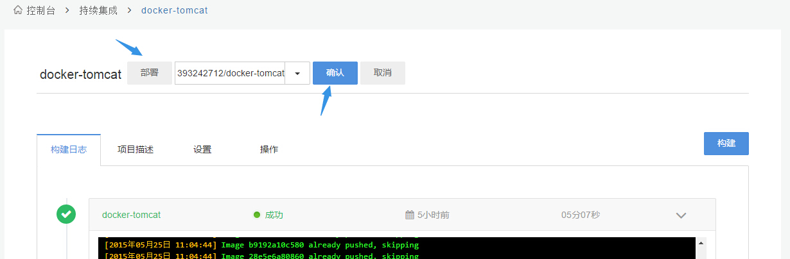
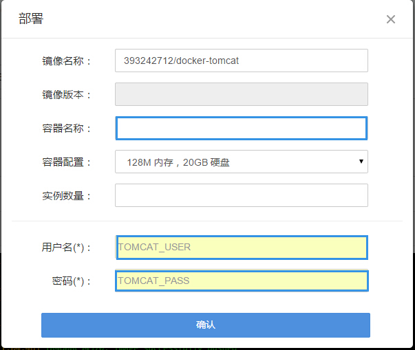

### 部署项目
 

在项目详情页，点击**部署**，再点击**确认**：

 

填写**容器名称**、**实例数量（不能超过5个）**，以及在添加项目时我们填写的环境变量**用户名**和**密码**，点击确认提交，页面会跳转到容器服务页面：

 

这样一个项目就部署成功了。

PS：构建失败的项目是无法部署的，如果发现项目构建成功了，但是**部署**按钮无法点击，请刷新页面后重试，如果还是无法点击，请发工单给时速云。

