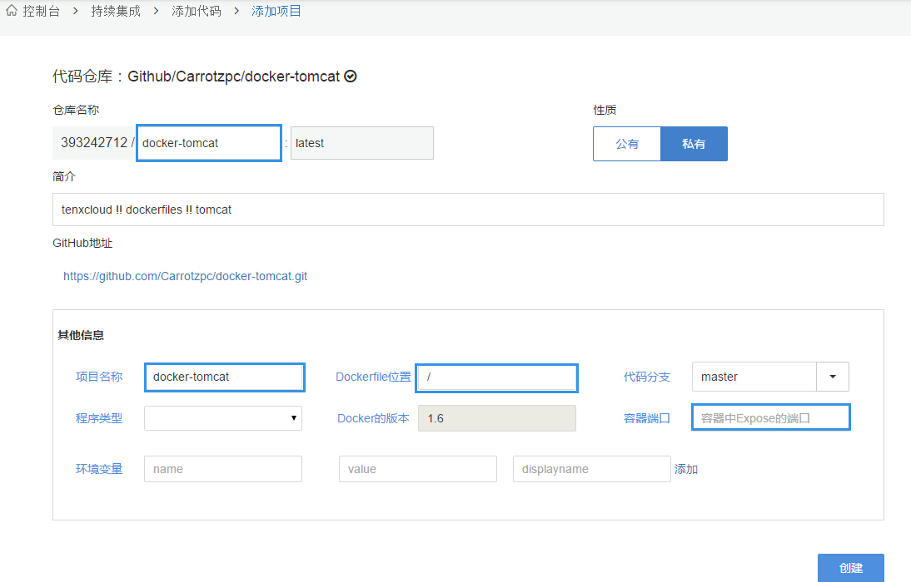
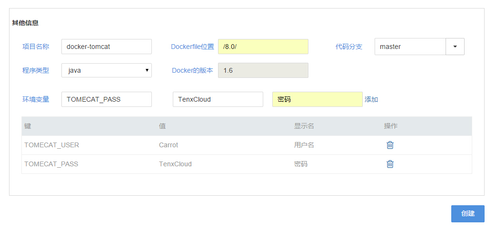

### 填写项目信息
在上一节我们点击**Carrotzpc/docker-tomcat**，进入了添加项目页面，我们来看下都需要填写什么：



下面列出了项目信息的所有表单，我们可以参考以下表格进行填写：

| 表单           | 说明 | 是否必填 |
| --             | -- | -- |
| 仓库名称       | ** 仓库名称只能由字母、数字及横线组成，且首字母不能为横线。 ** | 必填，**不能与自己名下的其他仓库名称相同，否则重名的镜像会被覆盖** |
| 简介           | 默认获取源代码简介 | 可选 |
| 项目名称       | 默认获取源代码项目名称 | 必填 |
| Dockerfile位置 | Dockerfile相对路径，默认为**'/'** | 必填 |
| 代码分支       | 默认均为master | 不可编辑 |
| 程序类型       | 编写项目的语言 | 可选 |
| Docker的版本   | 目前默认均为v1.6 | 不可编辑 |
| 环境变量       | 配置项目相关环境变量，可添加多个 | 可选 |

* 注：
 * 源代码中一定要有Dockerfile，否则构建会失败，可以点击GitHub地址查看自己的项目。
 * 系统会自动获取**Dokerfile**中EXPOSE的**容器端口**，如需重新设定，在项目构建完成后，在**项目详情页->操作->修改镜像**中重新设定。

下面是**docker-tomcat**项目**/8.0/**下的Dockerfile：

```
FROM tifayuki/java:7
MAINTAINER Feng Honglin <hfeng@tutum.co>

RUN apt-get update && \
    apt-get install -yq --no-install-recommends wget pwgen ca-certificates && \
    apt-get clean && \
    rm -rf /var/lib/apt/lists/*

ENV TOMCAT_MAJOR_VERSION 8
ENV TOMCAT_MINOR_VERSION 8.0.11
ENV CATALINA_HOME /tomcat

# INSTALL TOMCAT
RUN wget -q https://archive.apache.org/dist/tomcat/tomcat-${TOMCAT_MAJOR_VERSION}/v${TOMCAT_MINOR_VERSION}/bin/apache-tomcat-${TOMCAT_MINOR_VERSION}.tar.gz && \
    wget -qO- https://archive.apache.org/dist/tomcat/tomcat-${TOMCAT_MAJOR_VERSION}/v${TOMCAT_MINOR_VERSION}/bin/apache-tomcat-${TOMCAT_MINOR_VERSION}.tar.gz.md5 | md5sum -c - && \
    tar zxf apache-tomcat-*.tar.gz && \
    rm apache-tomcat-*.tar.gz && \
    mv apache-tomcat* tomcat

ADD create_tomcat_admin_user.sh /create_tomcat_admin_user.sh
ADD run.sh /run.sh
ADD webapps.tar /opt/data
RUN rm -rf /tomcat/webapps/*
RUN chmod +x /*.sh

EXPOSE 8080
CMD ["/run.sh"]
```
关于如何编写Dokerfile，可以参考英文官方文档 -> [编写Dockerfile](http://docs.docker.com/reference/builder/)，我们后续会提供中文版，并随时提供技术支持。

我们在**Dockerfile位置**中填写**/8.0/**，并填写环境变量（默认值可为空），如下图：



点击**创建**，页面跳转到项目详情页，开始构建项目，静待片刻后项目构建完成。


注：有些项目构建用时会比较长，我们正在优化构建环境，后续在速度上会有较大提升。


_ The End _
