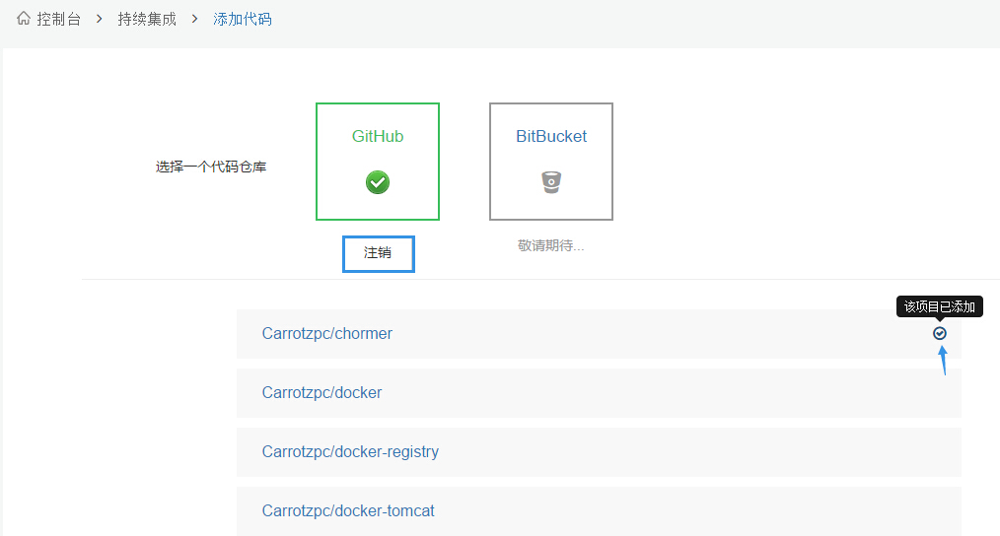
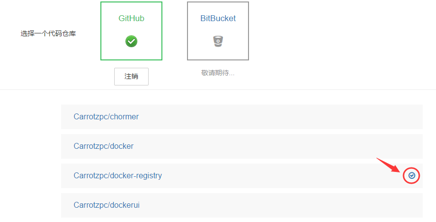

### 添加源代码
1. 首先要点击**添加源代码**，页面会跳转到添加源代码页面；

2. 然后要选择一个代码仓库，以GitHub为例：点击GitHub，页面会跳转到GitHub授权页面进行授权，如果没有登录GitHub要先登录，授权完成后，页面会跳回到添加源代码页面；

3. 看见 **√** 了吗，**√** 意思是那个GitHub项目你已经在时速云上创建了对应的项目，所以GitHub上的项目和时速云上的项目是一对一的关系，创建过了就不能创建了。
4. 你应该还注意到了 **注销** 按钮，点击注销会清除GitHub账户授权给时速云的token，如果要切换其他GitHub账户，记得点击完注销，再**清除浏览器缓存**。注意注销后持续集成将无法更新项目描述。
5. 这时页面会列出GitHub上的项目，点击任意一个项目进入[添加项目](project-fill.md)，我们点击**Carrotzpc/docker-tomcat**。
