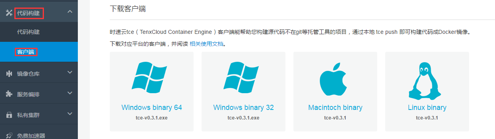

##使用 tce 客户端

#### **TenxCloud tce 客户端适合以下用户使用**
 1. 没有把代码托管到GitHub或者BitBucket等代码托管平台上，只有本地的代码或者可部署的应用，希望可以尝试和使用时速云提供的镜像和容器服务的用户
 2. 偏好通过客户端和TenxCloud container engine进行交互的用户
 注意：我们的客户端可以支持 Windows、Linux和 Mac 三种平台

#### **如何使用 tce 客户端**
1.   在 [www.tenxcloud.com](https://www.tenxcloud.com "时速云") 上注册用户
2.   登录并进入第二个功能块“集成”，点击绿色按钮“下载客户端”，在后面的页面中选择客户端的运行平台下载即可

3.   为了使用方便，下载后将tce的路径加入到系统的PATH下，以便在任意目录均可运行。可以参考以下步骤： 
 **Windows**: [添加到系统Path](http://jingyan.baidu.com/article/db55b6099d1e0d4ba30a2fc0.html) 
 **Linux**:  [添加到系统Path](http://zhidao.baidu.com/link?url=psqItfkdfNFruHE9WS-phqcjqyYyyzOPHbvIquTCib_EdSTRz1Xpp4BYs0zsBxYh8yZvE-w33BdKxLKEV9nyqK) 
 **Mac**:  修改 /etc/paths，将tce所在路径加上

#### **tce 用法说明书**

 **tce [选项]** 
*   help    查看帮助，列出所有tce命令 
*   login   登录 TenxCloud 容器引擎 
*   logout  退出 TenxCloud 容器引擎 
*   push    构建镜像，将本地的文件push到TenxCloud
 容器引擎并构建镜像

注：我们还在继续添加更多更酷的选项，让您更便捷的通过终端操作TenxCloud 容器引擎，尽请期待！

tce 使用详解：
 1. 通过终端进入代码目录，该目录下必须包含Dockerfile。关于如何编写Dokerfile，可以参考英文官方文档 -> [编写Dockerfile](http://docs.docker.com/reference/builder/)，我们后续会提供中文版，并随时提供技术支持。
 2. 输入`tce login`，填写用户、密码后完成登录
 3. 输入`tce push <image name>`，客户端会自动将Dockerfile及引用的本地文件打包成zip，并上传到TenxCloud，由我们的容器引擎创建Docker 镜像。这个过程会持续输出Docker build 的相关日志，方便跟踪镜像构建进度。
 注意：在这个过程中，我们会解析Dockerfile里的ADD 和COPY 指令集，打包所依赖的文件和目录，并且指令的源路径必须使用相对路径，不支持使用绝对路径，比如： 
 `ADD . /opt` 将当前目录下所有文件一起打包 
 `ADD testDir/. /opt` 将项目 testDir目录下所有文件打包 
 `ADD testDir/ /opt` 将项目testDir目录下所有文件打包 
 `ADD testDir/file*.txt /opt` * 匹配 
 `ADD testDir/file?.txt /opt` ? 匹配
 4. 镜像创建成功后，你可以通过
 [镜像控制台](https://www.tenxcloud.com/console/docker-registry) -> “我的镜像” 查看；还可以定义该镜像的服务接口，比如容器端口、环境变量等。

 5. 最后，进入到 “容器”
 控制台，就可以通过刚刚创建的镜像启动容器服务啦！

